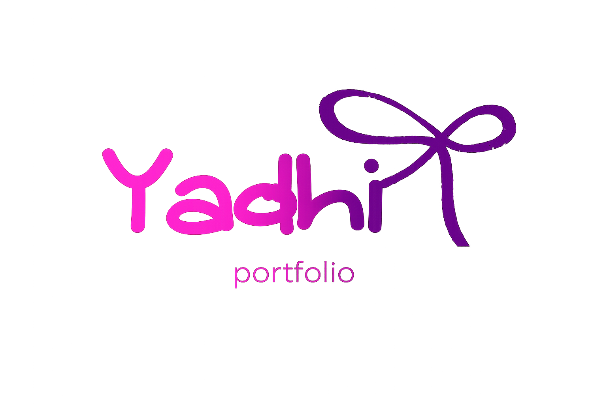

<div align="center">



# 🌸 Yadhira Saavedra

### Aspiring Data Analyst • Web Developer

<p>


</p>


### Showcasing my projects, skills, and continuous learning journey in web development and Data Analytics.

</div>

---

# 🌸 Preview

<p align="center">

</p>

---

# 💖 About

Welcome to my personal portfolio!

This project showcases my academic and personal work throughout my journey as a **Systems Engineering student**. It reflects my passion for web development, UI design, and continuous learning in **Data Analytics**.

---

# ✨ Features

| Section | Description |
|---------|-------------|
| 🏠 Home | Personal introduction and highlights |
| 👩 About Me | My background and interests |
| 💻 Tech Stack | Technologies and tools I use |
| 📂 Projects | Academic and personal projects |
| 🎓 Education | Learning journey and experience |
| 📩 Contact | Ways to get in touch |

---

# 🛠 Tech Stack

<div align="center">


</div>

---

# 📂 Featured Projects

- 🍕 La Esquina — Restaurant Management System
- 🗺 CalleGo — Safe Route UX/UI Prototype
- 👕 Nike Jacket Store
- 🔐 Modern Login UI

---

# 🏛 Project Structure

```text
src/
│
├── assets/
│
├── components/
│   ├── Contacto.jsx
│   ├── Experiencia.jsx
│   ├── Hero.jsx
│   ├── Navbar.jsx
│   ├── Proyectos.jsx
│   ├── SobreMi.jsx
│   └──Tecnologias.jsx
│
├── App.jsx
├── App.css
├── index.css
└── main.jsx
```

---

# 🚀 Installation

```bash
git clone https://github.com/yxdhii/yadhira-portafolio.git

cd portfolio

pnpm install

pnpm dev
```

---

# 🌐 Live Demo

👉 https://yadhira-portafolio.vercel.app

---

# 📌 Project Status

🩷 Active — Continuously updated with new projects and improvements.

---

<div align="center">

## 👩🏻‍💻 Developed by

# **Yadhira Patricia Saavedra Guadalupe**

Systems Engineering Student

Aspiring Data Analyst • Web Developer

<p align="center">

<a href="https://www.linkedin.com/in/itsyxdhi/">
  
</a>

<a href="https://yadhira-portafolio.vercel.app">
  
</a>

<a href="https://github.com/yxdhii">
  
</a>

</p>

⭐ Thank you for visiting my portfolio!

© 2026 · Yadhira Saavedra

</div>